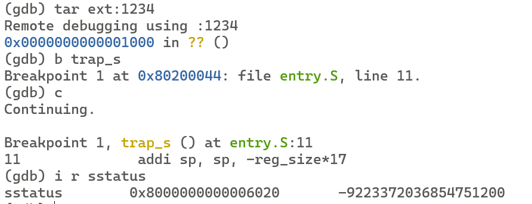
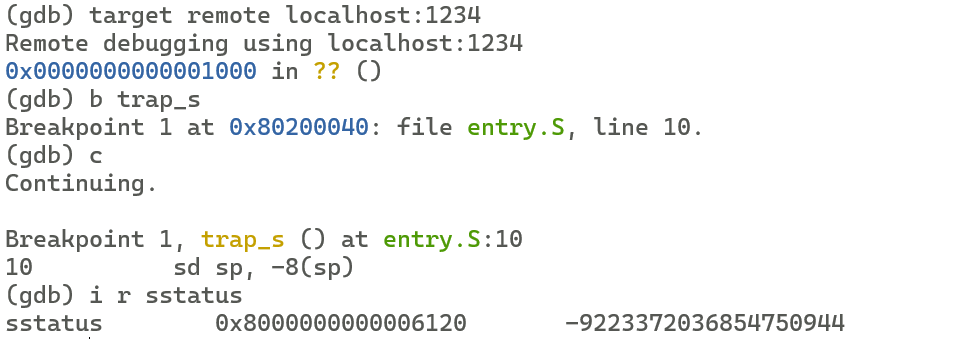
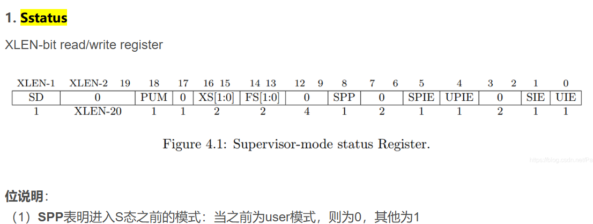
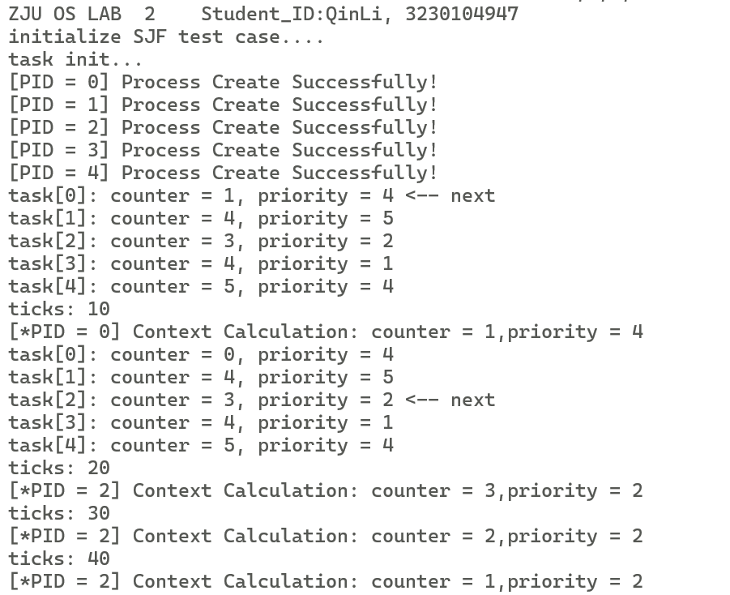
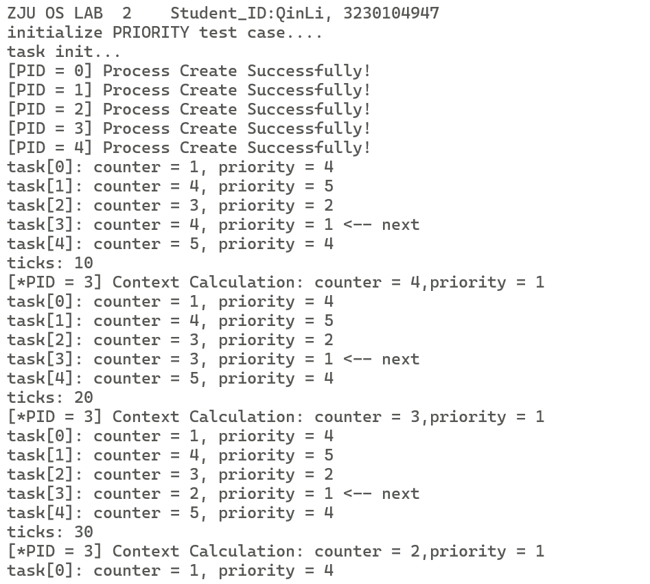

# Lab 2: RV64 进程调度模拟

<a name="ca927a96"></a>
## 1 实验目的

<br />结合课堂所学习的相关内容，在上一实验实现时钟中断的基础上进一步实现简单的进程调度。<br />

<a name="1bdb1875"></a>
## 2 实验内容及要求


- 理解进程调度与进程切换过程
- 利用时钟中断模拟进程调度实验，实现优先级抢占式算法和短作业优先非抢占式算法


<br />请各同学独立完成实验，任何抄袭行为都将使本次实验判为0分。<br />
<br />**请跟随实验步骤完成实验并根据文档中的要求记录实验过程，最后删除文档末尾的附录部分**，并命名为“**学号_姓名_lab2.pdf**"，你的代码请打包并命名为“**学号_姓名_lab2.zip**"，文件上传至学在浙大平台。<br />
<br />

<a name="b617e20b"></a>
## 3 实验步骤


<a name="95097dcc"></a>
### 3.1 环境搭建

<br />本实验提供的代码框架结构如图，你可以点击 [lab2.zip](https://yuque.zju.edu.cn/attachments/yuque/0/2025/zip/38563/1757646883878-0c39ea75-cb92-48da-86a3-fbaf8b27b777.zip?_lake_card=%7B%22uid%22%3A%221695214852161-0%22%2C%22src%22%3A%22https%3A%2F%2Fyuque.zju.edu.cn%2Fattachments%2Fyuque%2F0%2F2025%2Fzip%2F38563%2F1757646883878-0c39ea75-cb92-48da-86a3-fbaf8b27b777.zip%22%2C%22name%22%3A%22lab2.zip%22%2C%22size%22%3A25430%2C%22type%22%3A%22application%2Fzip%22%2C%22ext%22%3A%22zip%22%2C%22progress%22%3A%7B%22percent%22%3A99%7D%2C%22status%22%3A%22done%22%2C%22percent%22%3A0%2C%22id%22%3A%22lT9Zl%22%2C%22card%22%3A%22file%22%7D) 进行下载。首先，请下载相关代码，并移动至你所建立的本地映射文件夹中（即 `lab0` 中创建的 `os_experiment` 文件夹）。<br />

```c
.
├── Makefile
├── arch
│   └── riscv
│       ├── Makefile
│       └── kernel
│           ├── Makefile
│           ├── clock.c
│           ├── entry.S
│           ├── head.S
│           ├── init.c
│           ├── main.c
│           ├── print.c
│           ├── sbi.c
│           ├── sched.c
│           ├── test.c
│           ├── trap.c
│           └── vmlinux.lds
└── include
    ├── clock.h
    ├── defs.h
    ├── init.h
    ├── riscv.h
    ├── sbi.h
    ├── sched.h
    ├── stddef.h
    ├── stdio.h
    └── test.h
```

<br />**首先请阅读**[**【附录A.进程】**](#2b205fdc)**确保对实验相关知识有基本的了解。**<br />
<br />本实验意在模拟操作系统中的进程调度，实验中将定义结构体模拟进程的资源，利用时钟中断模拟 CPU 时间片以触发调度算法。 本实验中我们定义五个进程，分别是进程 `task[0-4]`。程序执行时，首先将 `task[0-4]` 的剩余运行时间设为 0，然后运行 `init_test_case()` 函数，根据 `counter_priority` 数组为进程分配相应的时间片与优先级，随后进行进程调度，根据运行结果观察调度算法实现正确性。<br />
<br />代码的总体框架工程文件均已给出，需要修改的部分均已进行了标注，主要包括：<br />

- `entry.s`：
   - `__init_sepc`：将 `sepc` 寄存器置为 `test()` 函数。
   - `__swtich_to`：需要保存当前进程的执行上下文，再将下一个执行进程的上下文载入到相关寄存器中。
- `sched.c`：
   - `task_init()`：对 `task[0-4]` 进行初始化。
   - `do_timer()`： 在时钟中断处理中被调用，首先会将当前进程的剩余运行时间减少一个单位，之后根据调度算法来确定是继续运行还是调度其他进程来执行。
   - `schedule()`：根据调度算法，考虑所有可运行的进程的优先级和剩余运行时间，按照一定规则选出下一个执行的进程。如果与当前进程不一致，则需要进行进程切换操作。
- `init.c`:
   - `intr_enable()`：打开中断开关，注意与 lab1 的区别，详见3.2
   - `intr_disable()`：关闭中断开关


<a name="7vnIT"></a>
#### 3.1.1 总体执行流程

1. 打开时钟中断开关，设置中断函数处理地址，设置第一次时钟中断时间，初始化任务的内存空间和结构体。
1. main 函数执行 call_first_process 函数，根据调度算法选择第一个应用程序，进入U态用户应用程序
1. 时钟中断发生，进入 trap_s 中断处理函数
1. trap_s 中断处理函数保护寄存器，然后进入 handler_s 处理函数
1. handler_s 判断是否是时钟中断，是的话进入 do_timer
1. do_timer 函数中，任务时间片减减
1. 如果时间片变成0，执行 schedule，选择出来下一个要执行的任务
1. switch_to 函数，更新 current 变量，然后调用 __switch_to 函数，做实际切换操作。
1. __switch_to 函数把当前进程的一些寄存器保存到进程的结构体中，然后读取要切换到的进程的寄存器。
1. 通过 ra 寄存器跳转到目标进程的执行位置处，开始正常执行下一个任务。
<a name="com8H"></a>
### 
<a name="rOW4y"></a>
### 3.2 init.c中打开中断开关（20%）


<a name="kK0sb"></a>
#### 3.2.1 理解用户应用程序与内核的运行状态与中断控制

<br />在 lab1 中，我们提到，qemu 完成初始化后默认处于 S 态，然后在 S 态运行内核。lab1 中我们始终处于 S 态（进入 OpenSBI 时处于 M 态），为了实现时钟中断，我们在S态把 `sstatus.sie` 设置为1，开启 S 态的中断。现在我们要实现用户应用程序（通过函数模拟），而为了系统的安全，用户应用程序需要运行在U态，来限制用户应用程序的权限。因此在 lab2 中，我们不再只运行在 S 态，而是在 S 态与 U 态进行切换。<br />
<br />在通常的系统中，进入 S 态后，我们会屏蔽掉 S 态的中断，避免再次中断干扰内核的运行，中断结束后返回 U 态时重新开启 S 态中断。这一功能已经由 RISC-V 硬件实现，请阅读 [RISC-V特权手册的4.1.1节](https://five-embeddev.com/riscv-isa-manual/latest/supervisor.html#sstatus) 中有关 SPP、SIE 与 SPIE 的内容，理解 RISC-V 是如何在不同状态下切换的，在不同状态下切换时中断开关是如何控制的。

我们需要修改 lab1 中中断使能的函数，利用 RISC-V 的机制，使得时钟中断在进入 U 态时被使能。<br />
<br />请完成 `init.c` 中的 `intr_enable()` 和 `intr_disable()`，**并在下方的代码框中补充完整你的代码：****（5%）**
```c
void intr_enable(void) {
  // TODO: 设置 sstatus[spie] = 1
  set_csr(sstatus,32);
}

void intr_disable(void) {
  // TODO: 设置 sstatus[spie] = 0
  clear_csr(sstatus,32);
}
```

<br />请在完成本次实验后，回答以下问题：（15%）<br />

1. RISC-V 是如何实现 S 态中断的屏蔽与使能的？<br />
RISC-V 通过 `sstatus` 寄存器中的 `SIE` 和 `SPIE` 位管理 S 态中断。`SIE` 是当前 S 态中断全局使能位，`SIE=1` 时允许响应中断，`SIE=0` 时则屏蔽。`SPIE` 用于备份发生异常/中断前的 `SIE` 状态。<br />
当中断发生时，硬件自动执行 `SPIE = SIE; SIE = 0;`，即在进入处理程序前屏蔽新中断并保存之前状态。处理完毕执行 `sret` 指令返回时，硬件自动执行 `SIE = SPIE; SPIE = 1;`，恢复之前的中断使能状态。<br />
状态变化流程

| 阶段 | 关键操作 | `SIE` 状态 | `SPIE` 状态 |
| :--- | :--- | :--- | :--- |
| 正常执行 | - | `1` (使能) | `1` |
| 中断发生 | `SPIE = SIE; SIE = 0;` | `0` (屏蔽) | `1` (备份) |
| 中断返回 | `SIE = SPIE; SPIE = 1;` | `1` (恢复) | `1` |

（提示：RISC-V 是如何控制 sstatus.SIE 与 sstatus.SPIE 的，它们分别代表什么含义）


2. 请验证在 lab1 中触发时钟中断时，cpu 处于 S 态，而 lab2 中触发时钟中断时，cpu处于 U 态，请给出sstatus的截图并作出解释：<br />

lab2截图:<br />

lab1截图:<br />



在 lab1 中，触发时钟中断时，`sstatus` 寄存器的 `SPP` 位（第八位）为 `1`，表示中断前 CPU 处于 S 态。而在 lab2 中，`SPP` 位为 `0`，表示中断前 CPU 处于 U 态。这是因为 lab1 中所有代码均运行在 S 态，而 lab2 中用户应用程序运行在 U 态，因此触发中断时 CPU 状态不同。

（提示：触发中断后，会进入中断处理流程，此时通过 gdb 查看 sstatus 寄存器，可以知道进入中断前 cpu处于什么态。）


3. lab2 中我们是什么时候第一次进入U态的？给出第一次进入U态的代码位置或截图：<br />（提示：sstatus 记录了进入中断前 cpu 处于什么状态，执行 sret 会回到该状态）


<br />

<a name="46b102a3"></a>
### 3.3 sched.c 进程调度功能实现（40%）


<a name="e3e94ac9"></a>
#### 3.3.1 调度算法切换

<br />本实验需要实现两种调度算法，可以使用 `make priority && make run` 和  `make sjf && make run` 运行不同的调度算法。`make` 默认会编译 `sjf` 算法。<br />
<br />**注意如果要切换不同的调度算法，需要先执行`make clean`。**<br />

> 调度算法的切换实际上是通过宏定义及编译选项 `gcc –D` 进行，在 `sched.c` 中使用 `#ifdef`，`#endif` 语句实现版本控制。


<a name="f9f70597"></a>
#### 3.3.2 实现 task_init()（10%）

<br />只有有了栈，才可以进行函数调用，因为在函数之间切换时需要进行“现场保存”，即保存寄存器信息，方便在结束函数调用时恢复原来的 cpu 状态。<br />

> 编译器在编译高级语言程序时，会自动加上保存现场的指令，因此通常不需要我们对栈进行操作。但是如果我们使用汇编代码（不是内联汇编，而是纯汇编代码，即 .s 文件），那么编译器就不会对我们的代码进行调整，所以如果我们使用汇编代码，就需要考虑寄存器保存。


<br />为了避免进程和进程之间互相影响，每个进程都要有属于自己的栈。内核在创建一个进程时，会创建两个栈，分别是供进程使用的用户栈和供内核使用的内核栈。<br />
<br />在 lab1 中，我们分配了一块内存作为栈，但并没有对用户栈和内核栈进行分离，用户态和内核态使用同一个栈。尽管这样可以正常运行，但是用户应用程序可以通过栈来获取到内核的信息甚至影响内核的运行，这对系统的安全来说是极大的威胁，因此在操作系统中，我们一般把用户栈和内核栈进行分离，这部分将在 `lab3 虚拟内存管理` 中实现。

在 lab1 中，我们实现了`trap_s`，在进程进入内核之后，将现场信息保存在栈中。在进程切换时，同样需要保存现场信息，所以我们在每个进程的栈中创建一个结构 `task_struct`，用于保存进程的元信息和进程切换时的寄存器信息。<br />
<br />在本实验中，我们提前给 Task[0-4] 分配好栈空间，并且仍不对内核栈和用户栈作区分。我们这样对物理内存区域进行划分（如下图）：此次实验中我们手动做内存分配，把物理地址空间划分成多个帧 (frame)。即，从 `0x80210000` 地址开始，连续地给此次实验的 5 个 Task [0-4] 做内存分配，我们以 `4KB` 为粒度，按照每个 Task 一帧的形式进行分配，并将 `task_struct` 存放在该帧的低地址部分， 将栈指针 `sp` 指向该帧的高地址。**（请同学按照下图的内存空间分配地址，不要随意修改，否则有可能影响到最终的实验结果）**<br />**<br />请思考：为什么可以用压栈的方式保存中断上下文，而不用压栈的方式保存 `task_struct`？<br />**
答：压栈保存中断上下文是因为中断的不可预测性和即时性要求，而task_struct保存进程上下文是因为进程切换的可预测性和持久性需求。这两种方式各自适应了不同的使用场景，是操作系统设计中的合理分工。
> 提示：task 数组是一个存储 task_struct 结构体指针的数组，在一般的 C 语言程序编写中会使用 malloc （操作系统或标准库提供） 来分配空间进行存储，但是我们现在还没有实现动态内存分配，因此只能提前申请内存并硬编码每个 task 的栈空间。实现动态内存管理之后，我们就可以动态地管理栈了。


```shell
---------------------------------------------------------------------------
|             |   Task0   |   Task1   |   Task2   |   Task3   |   Task4   |
|   Kernel    |           |           |           |           |           |
|             |   Space   |   Space   |   Space   |   Space   |   Space   |
---------------------------------------------------------------------------
^             ^           ^           ^           ^           ^
0x80200000    0x80210000  0x80211000  0x80212000  0x80213000  0x80214000
```

<br />为方便起见，我们将 Task [0-4] 进程均设为 `dead_loop()`（见 `test.c` ），也就是说每个 Task 执行的代码是一样的，这段代码的汇编被放到上图中 Kernel 里面了。<br />
<br />在 `task_init()` 函数中对实验中的进程进行初始化设置：<br />

- 初始化 `task[0-4]`
- 在初始化时，我们需要将 `thread` 中的 `ra` 指向一个初始化函数 `__init_sepc` (entry.S)，在该函数中我们将 `test` 函数地址赋值给 `sepc` 寄存器，详见【3.3.1】。


<br />**请在下方代码框中补充完整你的代码：**<br />

```c
void task_init(void) {
  puts("task init...\n");

  for(int i = 0; i < LAB_TEST_NUM; ++i) {
    // TODO
    // initialize task[i]
    // get the task_struct based on Kernel_Page and i
    // set state = TASK_RUNNING, counter = 0, priority = 5, 
    // blocked = 0, pid = i, thread.sp, thread.ra
    task[i] = (struct task_struct *)(Kernel_Page+PAGE_SIZE*i);
    task[i]->state = TASK_RUNNING;
    task[i]->counter = 0;
    task[i]->priority = 5;
    task[i]->blocked = 0;
    task[i]->pid = i;
    task[i]->thread.sp = (Kernel_Page+PAGE_SIZE*(i+1));
    task[i]->thread.ra = (long long unsigned int)__init_sepc;
    printf("[PID = %d] Process Create Successfully!\n", task[i]->pid);
  }
  task_init_done = 1;
}
```


<a name="c53598d0"></a>
#### 3.3.3 短作业优先非抢占式算法实现（15%）


- `do_timer()`
   - 将当前所运行进程的剩余运行时间减少一个单位（`counter--`）
   - 如果当前进程剩余运行时间已经用完，则进行调度，选择新的进程来运行，否则继续执行当前进程。
- `schedule()`
   - 遍历进程指针数组 `task`，从 `LAST_TASK` 至 `FIRST_TASK`，在所有运行状态(TASK_RUNNING)下的进程剩余运行时间最小的进程作为下一个执行的进程。若剩余运行时间相同，则按照遍历的顺序优先选择。**【注意， 测试代码只赋值了 5 个任务，但 `LAST_TASK` 是 64，遍历的时候注意先判断指针是否为空】**
   - 如果所有运行状态下的进程剩余运行时间都为0，则通过 `init_test_case()` 函数重新为进程分配运行时间与优先级，然后再次调度。


<br />**请在下方代码框中补充完整你的代码：**<br />

```c
#ifdef SJF
// simulate the cpu timeslice, which measn a short time frame that gets assigned
// to process for CPU execution
void do_timer(void) {
  if (!task_init_done) return;

  printf("[*PID = %d] Context Calculation: counter = %d,priority = %d\n",
         current->pid, current->counter, current->priority);
  
  // current process's counter -1, judge whether to schedule or go on.
  // TODO
  current->counter--;
  if(current->counter<=0){
    schedule();
  }
}

// Select the next task to run. If all tasks are done(counter=0), reinitialize all tasks.
void schedule(void) {
  unsigned char next;
  // TODO
  int all_zero = 1;
  struct task_struct* n;
  long min_counter = 0x7FFFFFFFFFFFFFFF;
  struct task_struct* p;
  for(int i=NR_TASKS-1;i>=0;i--){
    p = task[i];
    if(p&&p->counter!=0&&p->counter<min_counter){
      min_counter = p->counter;
      n = p;
      next = p->pid;
      all_zero = 0;
    }
  }
  
  if(all_zero){
    init_test_case();
    schedule();
    return;
  }
  
  show_schedule(next);
  
  switch_to(task[next]);
}

#endif
```


<a name="3105f827"></a>
#### 3.3.4 优先级抢占式算法实现（15%）


- `do_timer()`
   - 将当前所运行进程的剩余运行时间减少一个单位（`counter--`）
   - 每次 `do_timer()` 都进行一次抢占式优先级调度。
- `schedule()`
   - 遍历进程指针数组 `task`，从 `LAST_TASK` 至 `FIRST_TASK`，调度规则如下：
      - 高优先级的进程，优先被运行（值越小越优先）。
      - 若优先级相同，则选择剩余运行时间少的进程（若剩余运行时间也相同，则按照遍历的顺序优先选择）。
   - 如果所有运行状态下的进程剩余运行时间都为 0，则通过 `init_test_case()` 函数重新为进程分配运行时间与优先级，然后再次调度。


<br />**请在下方代码框中补充完整你的代码：**<br />

```c
#ifdef PRIORITY

// simulate the cpu timeslice, which measn a short time frame that gets assigned
// to process for CPU execution
void do_timer(void) {
  if (!task_init_done) return;
  
  printf("[*PID = %d] Context Calculation: counter = %d,priority = %d\n",
         current->pid, current->counter, current->priority);
  
  // current process's counter -1, judge whether to schedule or go on.
  // TODO
  current->counter--;
  schedule();  
}

// Select the task with highest priority and lowest counter to run. If all tasks are done(counter=0), reinitialize all tasks.
void schedule(void) {
  unsigned char next;
  int all_zero = 1;
  long n_priority = 0x7FFFFFFFFFFFFFFF;
  long n_counter = 0x7FFFFFFFFFFFFFFF;
  struct task_struct* n;
  struct task_struct* p;
  for(int i=NR_TASKS-1;i>=0;i--){
    p = task[i];
    if(p&&p->counter!=0&&(p->priority<n_priority||p->priority==n_priority&&p->counter<n_counter)){
      n_counter = p->counter;
      n_priority = p->priority;
      n = p;
      next = p->pid;
      all_zero = 0;
    }
  }
  if(all_zero){
    init_test_case();
    schedule();
    return;
  }
  show_schedule(next);

  switch_to(task[next]);
}

#endif
```

<br />

<a name="f2e8c54a"></a>
### 3.4 实现 entry.s（20%）


<a name="82a7dabf"></a>
#### 3.4.1  实现 __switch_to 函数（10%）

<br />实现切换进程的过程，`a0` 参数为 `struct task_struct* prev`，即切换前进程的地址。 `a1` 参数为 `struct task_struct* next` ，即切换后进程的地址。<br />

> 如果你不知道为什么 `a0` 寄存器和 `a1` 寄存器存储的是这两个参数的话，请参考 [RISC-V中文手册](https://www.yuque.com/imm/XlE5Gl4VFTeHBxfAeUwUXA%3D%3D%7Ceq21wbOJYMaU%2BSwn87A5xTj8A6RrThodjzKMrnJRLDFJVQKSJ2nqQDYAWOiHBWWZqSVEOdpLf%2FWQOhlGuXDlLw%3D%3D?x-yuque-pt-cb=&x-yuque-pt-expires=1662886493767&x-yuque-pt-id=57390&x-yuque-pt-signature=Vkdo5QBS7YAuZzbmTF%2F32zKnp1Y%3D) 第 3.2 节。


<br />该函数需要做以下事情。

- 保存当前的 `ra`， `sp`，`s0~s11` 寄存器到当前进程的 `thread_struct` 结构体中。
- 将下一个进程的 `thread_struct` 的数据载入到 `ra`，`sp`，`s0~s11` 中。


<br />保存 `sp` 和 `s0~s11` 是因为这些是 `callee saved registers`，其他的寄存器会被编译器自动保存到栈上，但是 `ra` 是 `caller saved register` 为什么也需要手动保存呢？这是因为我们需要在 `__switch_to`中完成控制流的切换，不同的进程可能会在不同的位置调用 `__switch_to`（尽管现在只能通过 `switch_to()` 一种方式），所以要手动完成 `ra` 的切换。<br />
<br />**请在下方代码框中补充完整你的代码：<br />**<br />

```c
# entry.S
__switch_to:
	li    a4,  40 
	add   a3, a0, a4
	add   a4, a1, a4
	# TODO: Save context into prev->thread
    sd ra, 0(a3)
	sd sp, 8(a3)
	sd s0, 16(a3)
	sd s1, 24(a3)
	sd s2, 32(a3)
	sd s3, 40(a3)
	sd s4, 48(a3)
	sd s5, 56(a3)
	sd s6, 64(a3)
	sd s7, 72(a3)
	sd s8, 80(a3)
	sd s9, 88(a3)
	sd s10, 96(a3)
	sd s11, 104(a3)
	# TODO: Restore context from next->thread
    ld ra, 0(a4)
	ld sp, 8(a4)
	ld s0, 16(a4)
	ld s1, 24(a4)
	ld s2, 32(a4)
	ld s3, 40(a4)
	ld s4, 48(a4)
	ld s5, 56(a4)
	ld s6, 64(a4)
	ld s7, 72(a4)
	ld s8, 80(a4)
	ld s9, 88(a4)
	ld s10, 96(a4)
	ld s11, 104(a4)
  
	# return to ra
	ret
```

<br />**为什么要设置前三行汇编指令？**<br />答：上下文隔离：在进程切换时，需要将当前进程的寄存器状态保存到其专属的 thread 结构中，并从下一个进程的 thread 结构中恢复寄存器状态。前三行指令通过计算正确的内存地址，确保了上下文数据被隔离存储在每个进程的 task_struct 中，避免了进程间相互干扰。

内存布局适配：在实验的内存分配方案中，task_struct 被放置在每个任务栈帧的低地址部分，而 thread 字段作为其中的一个成员，需要通过偏移量进行访问。偏移量40硬编码了 thread 在 task_struct 中的位置，这与实验预定的内存布局一致。

效率优化：通过提前计算基地址，后续的保存（sd）和恢复（ld）指令可以直接使用偏移寻址（如 0(a3)、8(a3)），减少了重复计算地址的开销，提升了上下文切换的效率。<br />

<a name="8f152a93"></a>
#### 3.4.2 __init_sepc（10%）

<br />为什么本实验在初始化时需要为 Task[0-4] 的 ra 寄存器指定为`__init_sepc`？<br />
<br />对于正常的进程切换流程（假设从进程A切换到进程B），控制流如下：<br />

```makefile
executing A -> 
	Time Interrupt -> 触发中断
		trap_s -> 将中断上下文压入A的栈中
			hander_s -> 进行进程调度
				... ->
					switch_to（in A） -> 调用__switch_to
							__switch_to ->  将A的进程上下文保存，将B的进程上下文加载到寄存器，此时发生了A的栈到B的栈的切换
					switch_to（in B） <- 此时已经进入B的控制流
                ... <-
            hander_s <-
        trap_s <- 从B的栈中弹出中断上下文，sret回到B的程序代码中
executing B <-
```

<br />可以看出能够进行进程切换，重要的一点是在栈上具有每个进程的控制流和上下文信息，这样在我们切换栈之后，就可以恢复原来的控制流。然而在第一次启动某个进程时，该进程的栈上没有任何信息，因此不能通过仅仅切换栈来启动某个进程，还需要手动设置`sepc`进入该进程的代码。<br />
<br />具体的方法是，将其任务结构体中的 `ra` 寄存器填写为 `__init_sepc` 的地址，这样，在 `__switch_to` 函数返回的时候，就会直接跳转到 `__init_sepc` 函数中。而该函数在 `sret` 时返回到 `test()` 函数，也就是进程实际的工作函数中。<br />
<br />将栈的内容（部分）展示出来如下：<br />

```c
=====================================================================================
===============================A已经启动，B第一次启动====================================
=====================================================================================

A进程执行中，发生时钟中断

在trap_s中将中断上下文压栈
栈顶    															  栈底
+--------------------------------------------------------------------+
|Atask_struct                                         saved register |
+--------------------------------------------------------------------+
 
按顺序依次 do_timer --> schedule --> switch_to (还有其他函数，在此不做展示)
+--------------------------------------------------------------------+
|Atask_struct     (switch_to)(schedule)(do_timer) ... saved register |
+--------------------------------------------------------------------+
			      ↑
                  sp, ra → switch_to 函数代码地址


现在执行 __switch_to, 保存了 A 进程的进程上下文，加载了 B 进程的进程上下文
+--------------------------------------------------------------------+
|Atask_struct          (switch_to)(schedule)(do_timer)saved register |
+--------------------------------------------------------------------+
+--------------------------------------------------------------------+
|Btask_struct                                                        |
+--------------------------------------------------------------------+
    																↑
                  													sp, 
																	ra → ？
__switch_to 通过 ret 跳转到 B 进程的 ra 处，此时的 ra 的值是我们初始化的值
    
1. 现在处于中断处理的 S 模式，开始执行代码的时候需要用 sret 指令返回 sepc 开始执行。
2. 第一次进入 B 进程，B 进程栈上什么也没有

因此需要一个特殊的启动函数 init_sepc ，他需要完成两件事情
1. sepc 设置成任务真正要开始执行的代码地址
2. 直接利用 sret 开始执行

=====================================================================================
===============================一个正常的切换流程=======================================
=====================================================================================

A进程执行中，发生时钟中断
+--------------------------------------------------------------------+
|Atask_struct                                         saved register |
+--------------------------------------------------------------------+
    
按顺序依次 do_timer --> schedule --> switch_to 函数
+--------------------------------------------------------------------+
|Atask_struct          (switch_to)(schedule)(do_timer)saved register |
+--------------------------------------------------------------------+
			           ↑
                       sp, ra → switch_to 函数代码地址


现在执行 __switch_to, 保存了 A 进程的 callee saved，加载了 B 进程的 callee saved
+--------------------------------------------------------------------+
|Atask_struct          (switch_to)(schedule)(do_timer)saved register |
+--------------------------------------------------------------------+
+--------------------------------------------------------------------+
|Btask_struct          (switch_to)(schedule)(do_timer)saved register |
+--------------------------------------------------------------------+
			           ↑
                       sp, ra → switch_to 函数代码地址

1. __switch_to 通过 ret 跳转到 B 进程的 ra 处
2. 继续执行，结束 switch_to 函数
3. 继续执行，结束 schedule 函数
4. 继续执行，结束 do_timer 函数
5. 继续执行 trap_s 的剩余部分

trap_s 剩余部分代码，恢复 B 进程的 saved register
+--------------------------------------------------------------------+
|Btask_struct                                         saved register |
+--------------------------------------------------------------------+
			                                          ↑
                                                      sp

最后，trap_s 使用 sepc 跳转回中断发生前代码执行的位置。
（因此 trap_s 需要保护 sepc 寄存器，即将 sepc 寄存器也保存在栈上一份）
```

<br />**请在下方代码框中补充完整你的代码：**<br />

```makefile
.globl __init_sepc
__init_sepc:
	# TODO
    la t0, test
	csrw sepc, t0
	sret
```

<br />

<a name="6d18a218"></a>
### 3.5 编译及测试（20%）

<br />运行`make priority && make run` 和  `make sjf && make run` 进行编译测试，请对 `main.c` 做修改，确保输出学号与姓名。<br />
<br />**注意如果要切换不同的调度算法，需要先执行`make clean`。**<br />

<a name="5a336962"></a>
#### 3.5.1 运行结果（20%）

<br />在 `test.c` 中的 `counter_priority`控制着进程的优先级以及时间片，共有三组测例，请将第一组测例的运行结果截图放在报告中，截图必须截到学号与姓名。并将全部测例的运行结果填到下面的表中。

注意：实验验收时将修改 `test.c` 中的 `counter_priority` 数组改变进程的优先级及剩余运行时间，确保代码在不同运行情况下的正确性。同学们可以自行设置测试用例进行实验以确保代码在边界情况的准确性，请将测试用例按照格式补充在表格中。<br />
<br />请在此附上你的代码运行结果截图。
<a name="26c3b37a"></a>
##### 短作业优先非抢占式算法
答：<br />

<a name="67e95983"></a>
##### 优先级抢占式算法
答：<br />

<a name="ae6a97b0"></a>
##### 短作业优先非抢占式算法


| 测试目标 | 测试用例{counter,priority} | 预期结果 | 实际结果 |
| --- | --- | --- | --- |
| 随机1 | {1, 4}, {4, 5}, {3, 2}, {4, 1}, {5, 4} | 1, 3, 4, 2, 5 | 1, 3, 4, 2, 5 |
| 随机2 | {3, 1}, {2, 1}, {4, 1}, {1, 1}, {1, 2} | 5, 4, 2, 1, 3 | 5, 4, 2, 1, 3 |
| 相同剩余运行时间，以遍历顺序执行 | {1, 1}, {1, 1}, {1, 1}, {1, 1}, {1, 1} | 5, 4, 3, 2, 1 | 5, 4, 3, 2, 1 |
|  |  |  |  |


<a name="67e95983-1"></a>
##### 短作业优先非抢占式算法


| 测试情况 | 测试用例{counter,priority} | 预期结果 | 实际结果 |
| --- | --- | --- | --- |
| 随机1 | {1, 4}, {4, 5}, {3, 2}, {4, 1}, {5, 4} | 4, 3, 1, 5, 2 | 4, 3, 1, 5, 2 |
| 随机2 | {3, 1}, {2, 1}, {4, 1}, {1, 1}, {1, 2} | 4，2，1，3，5 | 4，2，1，3，5 |
| 相同剩余运行时间，以遍历顺序执行 | {1, 1}, {1, 1}, {1, 1}, {1, 1}, {1, 1} | 5, 4, 3, 2, 1 | 5, 4, 3, 2, 1 |  |
|  |  |  |  |


<a name="357da1a6"></a>
## 4 讨论和心得
本次实验难度个人感觉适中，按照文件中的注释按部就班的写就大差不差了。对于我来说较为费时间的地方是实现短作业优先非抢占式算法和短作业优先非抢占式算法，通过学习才写对了判断条件。然后就是对进程的理解，我一直以为一个进程会调用两次init_sepc函数，但是验收时在助教gg的提醒下才意识到其实就一次。其余部分·感觉还好。<br />
lab2感觉没什么好建议的，实验文档已经很完美了。(๑•.•๑)