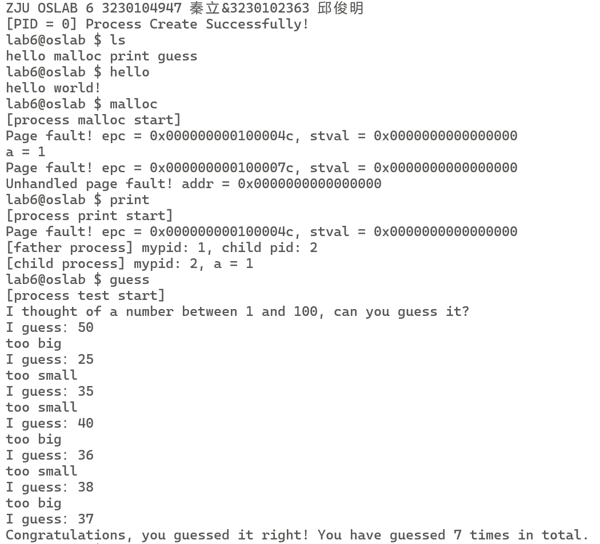

# Lab 5: RV64 缺页异常与Fork系统调用

<a name="72f31618"></a>
## **1 **实验目的
本实验在前序地址空间映射与调度实验的基础上，综合完成一个“能跑多进程用户程序”的简化操作系统内核。学生将利用已提供的物理内存分配器与 kmalloc/kfree 接口，基于 vm_area_struct 建立进程级虚拟内存抽象，实现 mmap/munmap 系统调用与按需分配的缺页异常处理；在此之上，进一步实现 fork/exec/wait/exit 等关键进程相关系统调用，使内核能够动态创建、执行与回收用户进程，从而整体理解 RV64 平台下虚拟内存管理与进程管理之间的协同工作机制。

- 理解基于 vm_area_struct 的虚拟内存抽象<br />
- 能实现 mmap/munmap 系统调用与延迟分配<br />
- 能实现缺页异常处理流程（Demand Paging）<br />
- 能实现 fork/exec/wait/exit 系统调用，支持多进程管理<br />


<a name="d77d4468"></a>
## **2 实验内容及要求**


- 使用已提供的 Buddy System 和 SLUB allocator，通过 kmalloc/kfree 完成内核动态内存管理（**说明为“已实现、可调用”，不再作为编码任务**）<br />
- 修改进程信息结构，补充虚拟内存相关信息 vm_area_struct / mm_struct<br />
- 实现 mmap/munmap 系统调用<br />
- 添加缺页异常处理 Page Fault Handler<br />
- 了解 Linux 系统中 fork 系统调用的实现方法
- 基于上述虚拟内存与动态内存，实现 fork/exec/wait/exit<br />


<br />请各小组独立完成实验，任何抄袭行为都将使本次实验判为0分。<br />
<br />**请跟随实验步骤完成实验并根据文档中的要求记录实验过程，最后删除文档末尾的附录部分**，并命名为“**学号1_姓名1_学号2_姓名2_lab5.pdf**"，你的代码请打包并命名为“**学号1_姓名1_学号2_姓名2_lab5**"，文件上传至学在浙大平台。<br />
<br />本实验以双人组队的方式进行，**仅需一人提交实验，**默认平均分配两人的得分（若原始打分为X，则可分配分数为2X，平均分配后每人得到X分）。如果有特殊情况请单独向助教反应，出示两人对于分数的钉钉聊天记录截图。单人完成实验者的得分为原始打分。

| 姓名 | 学号 | 分工 | 分配分数 |
| --- | --- | --- | --- |
|  |  |  | 50% |
|  |  |  | 50% |


<a name="b617e20b"></a>
## 3 实验步骤


<a name="9c7b3748"></a>
### 3.1 搭建实验环境

<br />本实验提供的代码框架结构如图，你可以点击 [lab5-1.zip](https://yuque.zju.edu.cn/attachments/yuque/0/2025/zip/44490/1764585647705-19d5990e-bea3-4415-853c-08d9adc42a2c.zip?_lake_card=%7B%22uid%22%3A%221764585647106-0%22%2C%22src%22%3A%22https%3A%2F%2Fyuque.zju.edu.cn%2Fattachments%2Fyuque%2F0%2F2025%2Fzip%2F44490%2F1764585647705-19d5990e-bea3-4415-853c-08d9adc42a2c.zip%22%2C%22name%22%3A%22lab5-1.zip%22%2C%22size%22%3A66041%2C%22type%22%3A%22application%2Fzip%22%2C%22ext%22%3A%22zip%22%2C%22progress%22%3A%7B%22percent%22%3A99%7D%2C%22status%22%3A%22done%22%2C%22percent%22%3A0%2C%22id%22%3A%22UkawJ%22%2C%22card%22%3A%22file%22%7D)[lab5-2.zip](https://yuque.zju.edu.cn/attachments/yuque/0/2025/zip/44490/1764585655076-308fff6a-a464-4f43-9c8e-8e63ac537492.zip?_lake_card=%7B%22uid%22%3A%221764585654525-0%22%2C%22src%22%3A%22https%3A%2F%2Fyuque.zju.edu.cn%2Fattachments%2Fyuque%2F0%2F2025%2Fzip%2F44490%2F1764585655076-308fff6a-a464-4f43-9c8e-8e63ac537492.zip%22%2C%22name%22%3A%22lab5-2.zip%22%2C%22size%22%3A71296%2C%22type%22%3A%22application%2Fzip%22%2C%22ext%22%3A%22zip%22%2C%22progress%22%3A%7B%22percent%22%3A99%7D%2C%22status%22%3A%22done%22%2C%22percent%22%3A0%2C%22id%22%3A%22nQNaP%22%2C%22card%22%3A%22file%22%7D)进行下载。首先，请下载相关代码，并移动至你所建立的本地映射文件夹中（即 `lab0` 中创建的) 本实验提供的代码框架结构如图。<br />
<br />5-1代码框架结构如图
```cpp
.
├── Makefile
├── arch
│   └── riscv
│       ├── Makefile
│       ├── kernel
│       │   ├── ...
│       │   ├── mm.c（新增）
│       │   └── slub.c（新增）
│       └── user
│           ├── Makefile
│           ├── lib
│           │   ├── Makefile
│           │   ├── include
│           │   │   ├── ...
│           │   │   └── mm.h（新增）
│           │   └── src
│           │       ├── ...
│           │       └── mm.c（新增）
│           ├── src
│           │   ├── Makefile
│           │   ├── test1.c
│           │   ├── test2.c
│           │   ├── test3.c
│           │   ├── test4.c
│           │   └── test5.c
│           └── users.S
└── include
    ├── ... 
    ├── list.h（新增）
    ├── mm.h（新增）
    └── slub.h（新增）
```

<br />其中`kernel/mm.c`与`kernel/slub.c`负责内核内存管理，`user/lib/src/mm.c`负责用户态内存管理。<br />
<br />我们在`list.h`中提供了linux list的实现，方便大家使用。代码实现部分给出了本实验涉及到的用法提示，足够大家完成本次实验，如果感兴趣可以参看[List 链表的使用教程](https://www.cnblogs.com/hwy89289709/p/6754300.html)学习相关用法。<br />
<br />5-2代码框架结构如图
```cpp
├── Makefile
├── arch
│   └── riscv
│       ├── Makefile
│       ├── kernel
│       │   ├── .......
│       │   ├── syscall.c  --> 需要修改
│       │   └── .......
│       └── user
│           ├── Makefile
│           ├── lib
│           │   ├── Makefile
│           │   ├── include
│           │   │   ├── getchar.h ---> 新增
│           │   │   ├── proc.h    ---> 新增
│           │   │   └── ......
│           │   └── src
│           │       └── ......
│           ├── src
│           │   └── .....
│           └── users.S
└── include
    └── ......
```


<a name="bf515b14"></a>
### 3.2 实现系统调用 （25%）lab5-1

<br />buddy system现在我们有了 kmalloc 和 kfree 的动态内存分配函数，接下来我们需要实现内存相关的系统调用，使得用户应用程序可以动态申请与释放内存。相关的系统调用编号定义在`syscall.h`中。<br />

<a name="4f069f17"></a>
#### 3.2.1 vm_area_struct

<br />尽管我们已经有了页表来管理我们的虚拟地址空间，但页表主要用于以页为粒度的细粒度内存管理，这在操作系统层面处理虚拟地址空间过于繁琐。为了更高效地管理虚拟地址空间，Linux引入了`vm_area_struct`数据结构。<br />
<br />`vm_area_struct`是一个重要的内核数据结构，它提供了一种更宏观的方式来描述虚拟地址空间的属性。不同于页表，`vm_area_struct`能够以更大的**内存块**为单位来管理虚拟地址空间的不同部分，使操作系统能够更有效地分配、释放和保护内存区域。这种更高级的管理使得虚拟内存管理更为灵活且易于理解，有助于操作系统的性能优化和应用程序的稳定性。<br />
<br />`vm_area_struct` 是虚拟内存管理的基本单元，`vm_area_struct` 保存了有关连续虚拟内存区域(简称vma)的信息。linux 具体某一进程的虚拟内存区域映射关系可以通过 [procfs](https://man7.org/linux/man-pages/man5/procfs.5.html) 读取 `/proc/pid/maps`的内容来获取：<br />
<br />比如，如下一个常规的 `bash`进程，假设它的进程号为 `7884`，则通过输入如下命令，就可以查看该进程具体的虚拟地址内存映射情况(部分信息已省略)。<br />

```shell
#cat /proc/7884/maps
556f22759000-556f22786000 r--p 00000000 08:05 16515165                   /usr/bin/bash
556f22786000-556f22837000 r-xp 0002d000 08:05 16515165                   /usr/bin/bash
556f22837000-556f2286e000 r--p 000de000 08:05 16515165                   /usr/bin/bash
556f2286e000-556f22872000 r--p 00114000 08:05 16515165                   /usr/bin/bash
556f22872000-556f2287b000 rw-p 00118000 08:05 16515165                   /usr/bin/bash
556f22fa5000-556f2312c000 rw-p 00000000 00:00 0                          [heap]
7fb9edb0f000-7fb9edb12000 r--p 00000000 08:05 16517264                   /usr/lib/x86_64-linux-gnu/libnss_files-2.31.so
7fb9edb12000-7fb9edb19000 r-xp 00003000 08:05 16517264                   /usr/lib/x86_64-linux-gnu/libnss_files-2.31.so               
...
7ffee5cdc000-7ffee5cfd000 rw-p 00000000 00:00 0                          [stack]
7ffee5dce000-7ffee5dd1000 r--p 00000000 00:00 0                          [vvar]
7ffee5dd1000-7ffee5dd2000 r-xp 00000000 00:00 0                          [vdso]
ffffffffff600000-ffffffffff601000 --xp 00000000 00:00 0                  [vsyscall]
```

<br />从中我们可以读取如下一些有关该进程内虚拟内存映射的关键信息：<br />

- `vm_start` :  (第1列) 指的是该段虚拟内存区域的开始地址；
- `vm_end`   :  (第2列) 指的是该段虚拟内存区域的结束地址；
- `vm_flags`  :  (第3列) 该`vm_area`的一组权限(rwx)标志，`vm_flags`的具体取值定义可参考linux源代码的[这里(linux/mm.h)](https://elixir.bootlin.com/linux/latest/source/include/linux/mm.h#L250)
- `vm_pgoff`  :  (第4列) 虚拟内存映射区域在文件内的偏移量；
- `vm_file`  :  (第5/6/7列)分别表示：映射文件所属设备号/以及指向关联文件结构的指针(如果有的话，一般为文件系统的inode)/以及文件名；


<br />其它保存在 `vm_area_struct`中的信息还有：<br />

- `vm_ops`   :  该 `vm_area` 中的一组工作函数;
- `vm_next/vm_prev`: 同一进程的所有虚拟内存区域由**链表结构**链接起来。


<br />在我们的实现中，我们使用linux list来实现链表。<br />
<br />`vm_area_struct` 结构已为你定义在 `task_manager.h` 文件中，如下。<br />

```c
/* 虚拟内存区域 */
typedef struct {
  unsigned long pgprot;
} pgprot_t;
struct vm_area_struct {
  /* Our start address within vm_area. */
  unsigned long vm_start;
  /* The first byte after our end address within vm_area. */
  unsigned long vm_end;
  /* linked list of VM areas per task, sorted by address. */
  struct list_head vm_list;
  // vm_page_prot和vm_flags的具体含义本实验不做要求，可以直接把vm_flags用于保存page_table的权限位。
  /* Access permissions of this VMA. */
  pgprot_t vm_page_prot;
  /* Flags*/
  unsigned long vm_flags;
  /* mapped */
  bool mapped;	// mmap是延迟分配内存的，mapped表示该内存块是否已经实际映射到了物理空间
};
```

<br />有了`vm_area_struct`之后，我们需要在`task_struct`中加入一个`vm_area_struct`的链表来管理每个进程动态申请的虚拟地址空间。<br />

```c
/* 内存管理 */
struct mm_struct {
  struct vm_area_struct *vm;
};


/* 进程数据结构 */
struct task_struct {
	...
  struct mm_struct mm;

};
```

<br />在task init时，你需要初始化`mm`，**将你编写好的 task_init 系统调用复制到下面代码框内：**<br />

```c
// task_manager.c

// initialize tasks, set member variables
void task_init(void) {
  puts("task init...\n");

  for(int i = 0; i < LAB_TEST_NUM; ++i) {
    ...
    // TODO: initialize task[i]->mm.vm using kmalloc and set the vm_list using INIT_LIST_HEAD
    
    ...
  }
  task_init_done = 1;
}
```

<br />为了减少大家的代码量，大家不需要把task init时的用户地址空间添加进`mm`中，只需要分配一个空`vm_area_struct`作为链表头即可。<br />

<a name="89cd3cf1"></a>
#### 3.2.2 MMAP


```c
void *mmap (void *__addr, size_t __len, int __prot,
                   int __flags, int __fd, __off_t __offset)
```

<br />Linux 系统一般会提供一个 `mmap` 的系统调用，其作用是为当前进程的虚拟内存地址空间中分配新地址空间（从 `void *__addr` 开始, 长度为 `size_t __len`字节），创建和文件的映射关系（ `__flags` 和 `__fd` 和 `__offset` 是文件相关的参数）。它可以分配一段匿名的虚拟内存区域，参数 `int __prot`表示了对所映射虚拟内存区域的权限保护要求。<br />
<br />`mmap`实际上只是记录了用户进程申请了哪些虚拟地址空间，实际的物理空间分配是在使用的时候，再通过缺页异常来分配的。mmap 这样的设计可以保证 mmap 快速分配，并且按需分配物理内存给进程使用。<br />
<br />而创建和文件的映射关系也有诸多好处，例如通过 mmap 机制以后，磁盘上的文件仿佛直接就在内存中，把访问磁盘文件简化为按地址访问内存。这样一来，应用程序自然不需要使用文件系统的 write（写入）、read（读取）、fsync（同步）等系统调用，因为现在只要面向内存的虚拟空间进行开发。<br />
<br />因为 Linux 下一切皆为文件，除了管理磁盘文件，还可以用 mmap 简化 socket，设备等其他 IO 管理。<br />
<br />在我们的实验中，我们只需要实现`mmap`分配内存空间的功能，并且对参数做出简化：<br />

1. 不考虑`__flags`、`__fd` 和 `__offset`参数
1. `__prot`参数与`PTE`的权限参数含义一致。


<br />具体的函数定义及参数含义如下：<br />

- `size_t`与`__off_t`为`unsigned long`的类型别名
- `__addr`:**建议**映射的虚拟首地址，需要按页对齐
- `__len`: 映射的长度，需要按页对齐
- `__prot`: 映射区的权限
- `__flags`: 由于本次实验不涉及`mmap`在Linux中的其他功能，该参数无意义
- `__fd`: 由于本次实验不涉及文件映射，该参数无意义
- `__offset`: 由于本次实验不涉及文件映射，该参数无意义
- 返回值：**实际**映射的虚拟首地址，若虚拟地址区域 `[__addr, __addr+__len)` 未与其它地址映射冲突，则返回值就是建议首地址 `__addr`，若发生冲突，则需要更换到无冲突的虚拟地址区域，返回值为该区域的首地址。<br />**注意：**为简化实验，你不需要考虑冲突的情况，只需要严格按照 __addr, __len 进行分配即可。


<br />`mmap` 映射的虚拟地址区域采用需求分页（Demand Paging）机制，即：`mmap` 中不为该虚拟地址区域分配实际的物理内存，仅当进程试图访问该区域时，通过触发 Page Fault，由 Page Fault 处理函数进行相应的物理内存分配以及页表的映射。<br />
<br />**该函数的操作步骤如下：**<br />

- 利用 kmalloc 创建一个 `vm_area_struct` 记录该虚拟地址区域的信息，并添加到 `mm` 的链表中
   - 调用 `kmalloc` 分配一个新的 `vm_area_struct`
   - 设置 `vm_area_struct` 的起始和结束地址为`start`, `start + length`
   - 设置 `vm_area_struct` 的 `vm_flags` 为 `prot`
   - 将该 `vm_area_struct` 插入到 `vm` 的链表中
- 返回地址区域的首地址


<br />这样，使用 mmap 函数就可以为当前进程注册一段虚拟内存了，这段申请的相关信息存在本进程的 `task_struct` 的 `vm_area_struct` 中。<br />
<br />**将你编写好的 mmap 系统调用复制到下面代码框内：**<br />

```c
// syscall.c

case SYS_MMAP: {
      // TODO: implement mmap
      // 1. create a new vma struct (kmalloc), if kmalloc failed, return -1
      // 2. initialize the vma struct
      // 2.1 set the vm_start and vm_end according to arg0 and arg1
      // 2.2 set the vm_flags to arg2
      // 2.3 set the mapped flag to 0
      // 3. add the vma struct to the mm_struct's vma list
      // return the vm_start

      break;
```


> 提示：使用 `list_add(struct list_head* node1, struct list_head* node2)`可以将node1插入到node2后


<a name="4855f4e4"></a>
#### 3.2.3 MUNMAP

<br />与`mmap`相对的是`munmap`系统调用，格式如下：<br />

```c
int munmap(void *addr, size_t len);
```

<br />`mnumap`将会释放任何与`[addr,addr+len]`有交集的页面映射，如果成功释放返回0，否则返回-1。在我们的实现中，我们要求`[addr, addr+len]`必须是一个完整的内存块，否则释放失败。<br />
<br />**将你编写好的 munmap 系统调用复制到下面代码框内：**<br />

```c
  case SYS_MUNMAP: {
      // TODO: implement munmap
      // 1. find the vma according to arg0 and arg1
      // note: you can iterate the vm_list by list_for_each_entry(vma, &current->mm.vm->vm_list, vm_list), then you can use `vma` in your loop
      // 2. if the vma mapped, free the physical pages (free_pages). Using `get_pte` to get the corresponding pte.
      // 3. ummap the physical pages from the virtual address space (create_mapping)
      // 4. delete the vma from the mm_struct's vma list (list_del).
      // 5. free the vma struct (kfree).
      // return 0 if success, otherwise return -1


      // flash the TLB
      asm volatile ("sfence.vma");
      break;


  }
```


> 提示：
> 1. 你可以通过`list_for_each_entry(vma, &current->mm.vm->vm_list, vm_list)`来遍历当前进程的vm_area链表，然后在循环体里使用`vma`访问每个vm_area_struct。注意提前定义vma。
> 1. 我们在`vm.c`中实现了`uint64_t get_pte(uint64_t *pgtbl, uint64_t va)`，来获取以pgtbl为根页表地址的虚拟地址va对应的页表项。


<a name="4c8f61ed"></a>
### 3.3 实现用户函数库

<br />我们已经在`user/lib/src/mm.c`中实现了`mmap`和`munmap`两个库函数。<br />

<a name="0ec4eb11"></a>
### 3.4 缺页异常处理 （25%）lab5-1

<br />现在，每个进程分配过的虚拟内存地址空间可以使用 `current->vm` 来访问，在前面我们讲过，我们的进程是需求分页机制，直到进程使用该虚拟内存地址的时候，我们才会分配物理内存给他。<br />
<br />也就是说，进程使用该虚拟内存地址的时候会发生缺页异常，内核在缺页异常的处理函数中，通过检查 `current->vm` 数据结构，检查缺页异常的地址落在什么范围内。最后根据对应范围的相关信息做物理内存映射即可。<br />

<a name="62dd6442"></a>
#### 3.4.1 缺页异常

<br />缺页异常是一种正在运行的程序访问当前未由内存管理单元（MMU）映射到虚拟内存的页面时，由计算机硬件引发的异常类型。访问未被映射的页或访问权限不足，都会导致该类异常的发生。处理缺页异常通常是操作系统内核的一部分。当处理缺页异常时，操作系统将尝试使所需页面在物理内存中的位置变得可访问（建立新的映射关系到虚拟内存）。如果非法访问内存，即发现触发 Page Fault 的虚拟内存地址(Bad Address)不在当前进程 `vm_area_struct` 链表中所定义的允许访问的虚拟内存地址范围内，或访问位置的权限条件不满足时，缺页异常处理将终止该程序的继续运行。<br />
<br />当系统运行发生异常时，可即时地通过解析 scause 寄存器的值，识别如下三种不同的 Page Fault。

| Interrupt/Exception <br />scause[XLEN-1] | Exception Code <br />scause[XLEN-2:0] | Description |
| --- | --- | --- |
| 0 | 12 | Instruction Page Fault |
| 0 | 13 | Load Page Fault |
| 0 | 15 | Store/AMO Page Fault |


<br />在lab3中，我们已经把缺页异常委托给了 S 态，当时如果触发缺页异常，我们会直接进入死循环。现在我们按照如下逻辑实现缺页异常处理程序：<br />

1. 首先读取`stval`的值，获取触发缺页异常的内存地址
1. 遍历vm_area，如果该地址落在某个area内部
   1. 如果权限符合要求，则为该area分配物理空间，并建立映射。注意不同的缺页异常要求的页面权限不同，如下图所示。具体请参看[Sv32标准](https://five-embeddev.com/riscv-isa-manual/latest/supervisor.html#sec:translation)（Sv39与Sv32的权限位含义相同）
   1. 如果不符合权限要求，则打印错误信息，并把`sepc + 4`跳过错误指令。建议打印出需要什么权限，而vm_area实际是什么权限。
3. 如果没有找到符合条件的vm_area，则报错并跳过错误指令（Done）


<br />**将你实现的Page fault处理程序复制在下面代码框内：**<br />

```c
// instruction page fault
if (cause == 0xc || cause == 0xd || cause == 0xf) {
  uint64_t stval;
  uint64_t* sp_ptr = (uint64_t*)(sp);

  // TODO: 
  // 1. get the faulting address from stval register


  printf("Page fault! epc = 0x%016lx, stval = 0x%016lx\n", epc, stval);


  struct vm_area_struct* vma;
  list_for_each_entry(vma, &current->mm.vm->vm_list, vm_list) {
    // TODO: 
    // 2. check whether the faulting address is in the range of a vm area
    // 3. check the permission of the vm area. The vma must be PTE_X/R/W according to the faulting cause, and also be PTE_V, PTE_U
    // 4. if the faulting address is valid, allocate physical pages, map it to the vm area, mark the vma mapped(vma->mapped = 1), and return
    // 5. otherwise, print error message and add 4 to the sepc
    // 6. if the faulting address is not in the range of any vm area, add 4 to the sepc (DONE)


  }
  sp_ptr[16] += 4;
  return;
}
```


<a name="699de708"></a>
### 3.5 编译和测试

<br />我们对test程序做了修改，其中test1为mmap正常测例，test2为munmap正常测例，test3与test4测试权限控制测例，test5为munmap异常测例。请确保你的每个测例都通过。<br />
<br />对 `main.c` 做修改，确保输出你的学号与姓名。在项目最外层输入 `make run` 命令调用 Makefile 文件完成整个工程的编译及执行。<br />
<br />**如果编译失败，及时使用 `make clean` 命令清理文件后再重新编译。**<br />
<br />请在此附上你的实验结果截图。
<a name="LwZ35"></a>
### 
<a name="mzP3r"></a>
### 
<a name="4YsBm"></a>
### 3.6 创建进程


<a name="2653dd3c"></a>
#### 3.6.1 批处理系统和进程
在完成了基于 `vm_area_struct` 的虚拟内存管理、`mmap/munmap` 和缺页异常处理之后，我们就具备了为「真正的多进程」提供隔离地址空间的基础。接下来，将在此基础上实现 fork/exec/wait/exit 等进程相关系统调用。<br />
<br />我们此前的实验已经为进程实现了许多应有的功能：上下文切换，地址空间，虚拟内存映射，动态内存分配管理等。惟一不足的地方在于，我们的进程总是在内核初始化的时候就定好了，无法在运行时新建进程。这事实上更像是批处理系统，每次导入一批任务，全部执行后再导入下一批任务。<br />
<br />因此，为了进程的灵活性，本实验将实现进程模型的几个重要系统调用：创建进程，执行新进程，等待进程结束，退出进程。有了这些系统调用，我们的 OS 进程管理就会更加灵活。<br />

<a name="51fa0876"></a>
#### 3.6.2 fork 系统调用

<br />Linux 系统启动时会创建一些特定进程，负责特定功能。例如 0 号 Idle 进程，1 号 init 进程等。这些进程都是内核硬编码的进程【即执行代码，如何进入该进程都在源代码中已写好，而不是一般的从硬盘加载一个程序运行】，其他所有的进程都是通过 fork 系统调用实现的。<br />

```cpp
// 功能：当前进程 fork 出来一个子进程。
// 返回值：对于子进程返回 0，对于当前进程则返回子进程的 PID 。
// syscall ID：220
int fork();
```

<br />假设 A 进程发起了 fork 系统调用，那么之后就会进入 A 进程的内核栈，并开始执行 fork 函数，fork 函数会创建一个新的进程 B，并完整的拷贝 A 进程的用户栈，代码段，数据段，动态内存分配的空间等。而且我们知道 A 进程返回到用户态程序的时候，执行的一定是 ecall 指令的下一行，因此进程 B 同样可以做好设置，使得 B 进程返回用户态程序时也在相同的位置开始执行。这样，A，B 两个进程就好像是从 ecall 开始分裂出来的两个一摸一样的进程。<br />
<br />注意，拷贝 A 进程的时候，我们用的是完全一致的虚拟地址空间，例如 A 进程 ecall 指令的下一行是 0x1000100。那么 B 进程回到用户态程序时也是回到 0x1000100 地址处。两者的虚拟地址完全一致，只是虚拟地址映射后的物理地址有所不同。【用户栈，动态内存分配的空间还需要使用 `alloc_page` 等新建物理空间，并拷贝 A 进程对应物理地址下的数据，之后建立映射】<br />

> A 进程执行时候使用的地址都是虚拟地址，因此只要 B 进程保证虚拟地址和 A 进程完全一致，就确保了 A，B 进程完全一致。


<br />当然，A 进程和 B 进程还是有一些区别的。我们把调用 fork 函数的进程称为父进程，创建出来的进程称为子进程，fork 函数执行的结果在父进程中是「子进程的PID」，在子进程中是 「0」。这个效果很容易实现，我们只需要把内核栈上的保存的 `a0` 寄存器的值修改即可。父进程的内核栈保存的 `a0` 寄存器值为「子进程的PID」，子进程则是 「0」。这样当切换到子进程的时候，从内核栈上恢复寄存器后，就达到了 fork 函数返回不同值的效果了。<br />

<a name="0ad5c931"></a>
#### 3.6.3 exec 系统调用

<br />有了 fork 函数能确保我们可以创建进程，然而这些进程都执行相同的代码。这样的效果还远远不够，为此，还需要 `exec` 系统调用。 `exec` 系统调用的功能就是将当前进程的地址空间清空并加载一个新的可执行程序。可以理解为回收空间，重新建立映射，然后「重头执行」。这样就可以执行别的进程了。<br />
<br />有了上述两个系统调用，我们就可以用如下代码启动一个新进程。<br />

```cpp
int pid = fork();
if (pid == 0) {
    // 子进程执行新程序
    exec("new program");
} else {
    // 父进程的代码
}
```


<a name="72074326"></a>
#### 3.6.4 wait 系统调用

<br />`wait` 系统调用是一种父子进程的通信手段，也是回收空间时的一种手段。fork 和 exec 的配合调用，会使得我们所有的进程都含有一个「父子关系」，即组织成一颗树的形式。有时候我们创建一个新进程出来，可能就是希望新进程完成某件事情并得到结果。 `wait` 系统调用就起到了这个作用，他的作用是等待某一个子进程执行完成后再继续执行（阻塞版实现），然后回收该子进程资源。<br />
<br />为什么需要使用 `wait` 系统调用来回收资源？假设我们正在执行 B 进程（父进程是 A 进程），那么 B 进程执行完成后回到 B 进程的内核栈，开始回收资源，这个时候我们会发现无法回收 B 进程的内核栈，因为回收了就有可能导致其他的内核函数无法正常执行（比如我们想要切换到别的进程去，这个时候内核栈都被回收了，就没有栈给函数用了）。因此我们需要把回收 B 进程内核栈的任务交给 A 进程去做。<br />

<a name="37e65bd0"></a>
#### 3.6.5 exit 系统调用

<br />`exit` 系统调用的功能就是退出程序，回收空间，并且返回一个退出代码。例如在 C 语言中有如下代码：<br />

```cpp
#include <stdlib.h>

int main() {
    if (...) {
        // 偶尔也会主动调用 exit 退出程序
        exit(1);
    }
    return 0;
}
```

<br />一般来说，0代表正常返回，其他数字则代表异常返回，不同数字有不同含义等。<br />
<br />只看代码我们可以得知 main 函数结束时整个进程执行结束，然而我们需要在进程结束时回到内核态来回收该进程空间。为此，我们可以在用户态程序结束时候（隐式的）调用 exit 系统调用来实现这个效果。<br />
<br />在本实验中，我们为每个用户态程序开头加入了如下代码段：<br />

```c
_start:
    call main # a0 是 main 函数的返回值
    call exit # a0 作为 exit 函数的参数
```

<br />这样就实现了 main 函数结束的时候调用 exit 函数的效果。而无需 main 函数中手动调用。<br />

<a name="f0112274"></a>
### 3.7 实现 fork/exec/wait/exit（50%）lab5-2


<a name="2acb889b"></a>
#### 3.7.1 其他代码调整 (已完成)

<br />我们需要修改部分代码来适配 fork 系统调用。<br />
<br />首先，我们需要在 `task_manager.c` 文件中的 `task_init` 函数中只为 0 号进程分配空间，并安排他执行 `test0.c` 的程序（我们写好的一个 shell 程序，这相当于我们提到的硬编码程序）。<br />

```cpp
// initialize tasks, set member variables
void task_init(void) {
  // only init the first process
  struct task_struct* new_task = (struct task_struct*)(VIRTUAL_ADDR(alloc_page()));
    .......
    .......
  new_task->pid = 0;
    .......
  create_mapping(.....);
    .......
    .......
  printf("[PID = %d] Process Create Successfully!\n", task[0]->pid);
}
```

<br />接下来，我们移动了内核态下处理 syscall 调用后，设置 a0, a1, sepc 寄存器的部分。如下<br />

```cpp
else if (cause == 0x8) {
    uint64_t* sp_ptr = (uint64_t*)(sp);
    uint64_t syscall_num = sp_ptr[11];
    uint64_t arg0 = sp_ptr[4], arg1 = sp_ptr[5], arg2 = sp_ptr[6], arg3 = sp_ptr[7], arg4 = sp_ptr[8], arg5 = sp_ptr[9];

    syscall(syscall_num, arg0, arg1, arg2, arg3, arg4, arg5, sp);
    
    // =========================
    // | sp_ptr[4] = ret.a0;   |
    // | sp_ptr[5] = ret.a1;   |
    // | sp_ptr[16] += 4;      |
    // =========================
}
```

<br />我们把上述方框部分移动到了 syscall 函数内部，这样特定的系统调用就可以根据功能来修改这些寄存器的值了。<br />

<a name="7f94454d"></a>
#### 3.7.2 实现 fork 系统调用 (30%)

<br />本实验中，我们需要实现第 220 号系统调用 `fork` 。和之前一样，我们仍然在 `syscall.c` 文件中统一实现，其函数原型如下：<br />

```cpp
int fork(void);
```

<br />其执行流程如下：<br />

1. 创建新进程，设置 counter，priority，pid 等内容（counter 可任意设置，但需要不为 0，pid 需要保证不重复）。注意存放在我们的 `task` 数组中。
2. 创建页表，设置 task->satp
   1. 拷贝当前进程的用户进程代码地址，建立映射（当前进程运行的用户进程代码起始地址保存在 `task->mm.user_program_start` 处，用户进程代码占用一页大小）
   2. 创建内核地址映射 （和 Lab 3 一致，包含 0xffff.... 的虚拟内存映射和等值映射）
   3. 创建 UART 的硬件地址映射（和 Lab 3 一致）
3. 分配一页用来做新进程的用户栈，拷贝当前进程的用户栈内容到新进程中，设置好新进程的用户栈指针(task->sscrath)。另外，将用户栈物理地址保存到 `task->mm.user_stack` 中，方便之后的回收。
4. 拷贝动态内存管理部分 `task->mm.vm` ，拷贝动态内存分配的空间内容，并且建立对应的映射。
5. 正确设置当前进程内核栈上的 a0, sepc 值
6. 拷贝内核栈内容（只需要拷贝 trap_s 的内核栈）
7. 正确设置新进程内核栈上的 a0, sepc 值，以及 `task->thread.sp` ， `task->thread.ra` 。

**注意**：这里用到的 `task->mm` / `vm_area_struct` / mmap 映射关系，均来自本实验前半部分实现的虚拟内存管理。
> 为了让 fork 出来的新进程能够在被调度的时候正确执行。我们需要在第 6 步保存 trap_s 的内核栈内容。（实际上就是保存了陷入系统调用时候用户态的所有寄存器内容，【注意这里是所有，和之前实验有区别】）之后，我们在第 7 步时，直接设置 ra 为 trap_s 的后半段内容，也就是从恢复寄存器的部分开始 (trap_s_bottom)，这样就能保证重新调度到 fork 出来的程序的时候正常运行。


<br />之后， `fork` 系统调用执行完毕，父进程继续执行。直到下次触发进程切换到子进程后，才真正的运行子进程。<br />
<br />重新调度到子进程时的内核栈示意图。注意：Linux 中 fork 出来的子进程重新调度到的时候，将从 ret_from_fork 函数开始执行，该函数作用就是恢复内核栈上的寄存器，然后回到用户态执行代码。对应本实验中的 trap_s_bottom。<br />

```c
A 是当前进程，B 进程是 fork 新建的进程
+--------------------------------------------------------------------+
|Atask_struct                      (syscall)(handle_s)saved register |
+--------------------------------------------------------------------+
+--------------------------------------------------------------------+
|Btask_struct                                         saved register |
+--------------------------------------------------------------------+
			                                          ↑
                        我们只复制这些部分，其他部分不用复制 sp, ra = trap_s_bottom


下一次调度到 B 进程的时候
+--------------------------------------------------------------------+
|Btask_struct                                         saved register |
+--------------------------------------------------------------------+
			                                          ↑
                                                      sp, ra = trap_s_bottom

直接从 trap_s_bottom 开始，就可以恢复原先用户态进程下的所有寄存器了
```

<br />请将你编写好的代码填入下方代码框中。<br />

```cpp
// syscall.c: 64

........

    case SYS_FORK: {
        // TODO:
        // 1. create new task and set counter, priority and pid (use our task array)
        int i;
        for(i=0;i<NR_TASKS;i++){ 
            if(!task[i]||task[i]->counter==0)break; 
        }
        if(i==NR_TASKS) break;
        if(!task[i]){
            task[i] = (struct task_struct*)(VIRTUAL_ADDR(alloc_page()));
        }
        task[i]->state = TASK_RUNNING;
        task[i]->counter = 1000;
        task[i]->priority = 1000;
        task[i]->blocked = 0;
        task[i]->pid = i;
        // 2. create root page table, set current process's satp
        uint64_t root_page_table =  alloc_page();
        task[i]->satp = root_page_table >> 12 | 0x8000000000000000 | (((uint64_t) (task[i]->pid))  << 44);
        //   2.1 copy current process's user program address, create mapping for user program
        task[i]->mm.user_program_start = current->mm.user_program_start;
        create_mapping((uint64_t*)root_page_table, 0x1000000, task[i]->mm.user_program_start, PAGE_SIZE, PTE_V | PTE_R | PTE_X | PTE_U | PTE_W);
        //   2.2 create mapping for kernel address
        create_mapping((uint64_t*)root_page_table, 0xffffffc000000000, 0x80000000, 16 * 1024 * 1024, PTE_V | PTE_R | PTE_W | PTE_X);
        create_mapping((uint64_t*)root_page_table, 0xffffffc000000000, 0x80000000, PHYSICAL_ADDR((uint64_t)&rodata_start) - 0x80000000, PTE_V | PTE_R | PTE_X);
        create_mapping((uint64_t*)root_page_table, (uint64_t)&rodata_start, PHYSICAL_ADDR((uint64_t)&rodata_start), (uint64_t)&data_start - (uint64_t)&rodata_start, PTE_V | PTE_R);
        create_mapping((uint64_t*)root_page_table, (uint64_t)&data_start, PHYSICAL_ADDR((uint64_t)&data_start), (uint64_t)&_end - (uint64_t)&data_start, PTE_V | PTE_R | PTE_W);
        create_mapping((uint64_t*)root_page_table, 0x80000000, 0x80000000, 16 * 1024 * 1024, PTE_V | PTE_R | PTE_W | PTE_X);
        create_mapping((uint64_t*)root_page_table, 0x80000000, 0x80000000, PHYSICAL_ADDR((uint64_t)&rodata_start) - 0x80000000, PTE_V | PTE_R | PTE_X);
        create_mapping((uint64_t*)root_page_table, PHYSICAL_ADDR((uint64_t)&rodata_start), PHYSICAL_ADDR((uint64_t)&rodata_start), (uint64_t)&data_start - (uint64_t)&rodata_start, PTE_V | PTE_R);
        create_mapping((uint64_t*)root_page_table, PHYSICAL_ADDR((uint64_t)&data_start), PHYSICAL_ADDR((uint64_t)&data_start), (uint64_t)&_end - (uint64_t)&data_start, PTE_V | PTE_R | PTE_W);
        //   2.3 create mapping for UART address
        create_mapping((uint64_t*)root_page_table, 0x10000000, 0x10000000, 1 * 1024 * 1024, PTE_V | PTE_R | PTE_W | PTE_X);
        // 3. create user stack, copy current process's user stack and save user stack sp to new_task->sscratch
        uint64_t physical_stack = alloc_page();
        task[i]->sscratch = read_csr(sscratch);
        create_mapping((uint64_t*)root_page_table, 0x1001000, physical_stack, PAGE_SIZE, PTE_V | PTE_R | PTE_W | PTE_U);
        memcpy((uint64_t *)physical_stack, (uint64_t *)current->mm.user_stack, PAGE_SIZE);
        task[i]->mm.user_stack = physical_stack;
        // 4. copy mm struct and create mapping
        task[i]->mm.vm = kmalloc(sizeof(struct vm_area_struct));
        INIT_LIST_HEAD(&(task[i]->mm.vm->vm_list));
        struct vm_area_struct* vma;
        list_for_each_entry(vma, &current->mm.vm->vm_list, vm_list) {
            struct vm_area_struct * copy = kmalloc(sizeof(struct vm_area_struct));
            memcpy(copy, vma, sizeof(struct vm_area_struct));
            list_add(&(copy->vm_list), &task[i]->mm.vm->vm_list);
            if (vma->mapped==1) {
                uint64_t pa = alloc_pages((vma->vm_end - vma->vm_start) / PAGE_SIZE);
                create_mapping((uint64_t*)root_page_table, vma->vm_start, pa, vma->vm_end - vma->vm_start, vma->vm_flags);
                uint64_t pte = get_pte((current->satp & ((1ULL << 44) - 1)) << 12, vma->vm_start);
                memcpy((uint64_t *)pa, (uint64_t *)((pte >> 10) << 12), vma->vm_end - vma->vm_start);
            }
        }
        // 5. set current process a0 = new task pid, sepc += 4
        sp_ptr[4] = task[i]->pid;
        sp_ptr[16] += 4;
        // 6. copy kernel stack (only need trap_s' stack)
        memcpy((uint64_t*)((uint64_t)task[i] + PAGE_SIZE - 31 * 8), (uint64_t*)((uint64_t)current + PAGE_SIZE - 31 * 8), 31 * 8);
        // 7. set new process a0 = 0, and ra = trap_s_bottom, sp = register number * 8
        *(uint64_t *)((uint64_t)(sp_ptr + 4) - (uint64_t)current + (uint64_t)task[i]) = 0;
        task[i]->thread.sp = (uint64_t)task[i] + PAGE_SIZE - 31 * 8;
        task[i]->thread.ra = (uint64_t)&trap_s_bottom;
        break;
    }

........
```


<a name="e9588b00"></a>
#### 3.7.3 实现 exec 系统调用 (10%)

<br />接下来，我们需要实现 191 号系统调用 `exec` ，该系统调用接收一个参数 `arg0` ，表示的是需要执行的进程的名称。可以使用已经写好的 `get_program_address(arg0)` 函数获得要执行的新用户进程的代码地址。<br />
<br />`exec` 系统调用的函数原型如下：<br />

```cpp
void exec(const char * name);
```

<br />其执行流程如下：<br />

1. 清空当前进程的动态内存分配区域 `task->mm.vm` ，包括映射和空间回收
2. 重置用户栈指针（ssratch）【我们复用用户栈】和 user_program_start【我们复用用户进程代码】
3. 重新设置用户进程代码的虚拟地址映射【使用 `get_program_address` 获取新的用户进程代码的首地址】 (注意修改了映射后需要使用 sfence.vma 刷新 TLB)
4. 重新设置 sepc


<br />请将你编写好的代码填入下方代码框中。<br />

```cpp
// syscall.c: 79

........

    case SYS_EXEC: {
        // TODO:
        // 1. free current process vm_area_struct and it's mapping area
        // 2. reset user stack, user_program_start
        // 3. create mapping for new user program address
        // 4. set sepc = 0x1000000
        // 5. refresh TLB
        uint64_t root_page_table = (current->satp & ((1ULL << 44) - 1)) << 12;
        struct vm_area_struct* vma;
        list_for_each_entry(vma, &current->mm.vm->vm_list, vm_list) {
            if (vma->mapped == 1) {
                uint64_t pte = get_pte((uint64_t*)root_page_table, vma->vm_start);
                free_pages((pte >> 10) << 12);
            }
            create_mapping((uint64_t*)root_page_table, vma->vm_start, 0, (vma->vm_end - vma->vm_start), 0);
            list_del(&(vma->vm_list));
            kfree(vma);
        }
        write_csr(sscratch, 0x1001000 + PAGE_SIZE);
        current->mm.user_program_start = get_program_address((char *)arg0);
        create_mapping((uint64_t*)root_page_table, 0x1000000, current->mm.user_program_start, PAGE_SIZE, PTE_V | PTE_R | PTE_X | PTE_U | PTE_W);
        asm volatile ("sfence.vma");
        sp_ptr[16] = 0x1000000;
        break;
    }
 
........
```


<a name="66f10c3e"></a>
#### 3.7.4 实现 wait 系统调用 (5%)

<br />然后，我们需要实现 247 号系统调用 `wait` ，该系统调用接收一个参数 `arg0` ，表示的是要等待执行完的子进程的 pid。<br />
<br />`wait` 系统调用的函数原型如下：<br />

```cpp
void wait(int pid);
```

<br />其执行流程如下：<br />

1. 找到要等待的进程的 pid。
2. 如果没有，正确设置 sepc 的值并返回。
3. 如果找到，但是 counter = 0，说明该进程执行完毕，回收他的内核栈与页表。
4. 如果找到，但是counter != 0，则需要修改当前进程的优先级，使得要等待的子进程优先被调度，之后调用 schedule 函数主动切换进程。【之后再次被调度回来的时候需要循环检查，直到进入 3】


<br />请将你编写好的代码填入下方代码框中。<br />

```cpp
// syscall.c: 98

........

    case SYS_WAIT: {
        // TODO:
        // 1. find the process which pid == arg0
        // 2. if not find
        //   2.1. sepc += 4, return
        // 3. if find and counter = 0
        //   3.1. free it's kernel stack and page table
        // 4. if find and counter != 0
        //   4.1. change current process's priority
        //   4.2. call schedule to run other process
        //   4.3. goto 1. check again
        int exec_finish = 0;
        while (!exec_finish) {
            exec_finish = 1;
            for (int i = 0; i < NR_TASKS; i++) {
                if (task[i]) {
                    if (task[i]->pid == arg0 && task[i]->counter > 0) {
                        current->priority = task[i]->priority + 1;
                        exec_finish = 0;
                        schedule();
                    }
                    uint64_t root_page_table = (task[i]->satp & ((1ULL << 44) - 1)) << 12;
                    if(task[i]->pid == arg0 && task[i]->counter == 0){
                        free_pages(root_page_table);
                        task[i]->thread.sp = (uint64_t)task[i] + PAGE_SIZE;
                    }
                }
            }
        }
        sp_ptr[16] += 4;

        break;
    }
 
........
```


<a name="52d90566"></a>
#### 3.7.5 实现 exit 系统调用 (5%)

<br />最后，我们需要实现 60 号系统调用 `exit` ，该系统调用接收一个参数 `arg0` ，表示的是进程退出的返回值。<br />
<br />`exit` 系统调用的函数原型如下：<br />

```cpp
void exit(int code);
```

<br />其执行流程如下：<br />

1. 清空当前进程的动态内存分配区域 `task->mm.vm` ，包括映射和空间回收。
2. 清空用户栈。
3. 清空当前 task_struct 信息，设置 counter = 0，避免再次调度。
4. 调用 schedule，执行别的进程。


> 注意：这里不能直接回收内核栈，否则 schedule 调用就无栈可用了。这个问题在 3.2.4 节也有描述。其内核栈回收应该在 wait 系统调用时实现。


<br />请将你编写好的代码填入下方代码框中。<br />

```cpp
// syscall.c: 88

........

    case SYS_EXIT: {
        // TODO:
        // 1. free current process vm_area_struct and it's mapping area
        uint64_t root_page_table = (current->satp & ((1ULL << 44) - 1)) << 12;
        struct vm_area_struct* vma;
        list_for_each_entry(vma, &current->mm.vm->vm_list, vm_list) {
            if (vma->mapped == 1) {
                uint64_t pte = get_pte((uint64_t*)root_page_table, vma->vm_start);
                free_pages((pte >> 10) << 12);
            }
            create_mapping((uint64_t*)root_page_table, vma->vm_start, 0, (vma->vm_end - vma->vm_start), 0);
            list_del(&(vma->vm_list));
            kfree(vma);
        }
        kfree(&(current->mm.vm));
        current->mm.vm = NULL;
        // 2. free user stack
        free_pages(current->mm.user_stack);
        current->mm.user_stack = 0;
        // 3. clear current task, set current task->counter = 0
        current->counter = 0;
        // 4. call schedule
        schedule();
        break;
    }
 
........
```


<a name="ae826112"></a>
#### 3.7.6 用户侧实现（已完成）

<br />用户侧需要和之前的实验一样，写好对应的用户侧的系统调用。该部分比较简单，已完成。<br />

<a name="b4767f1c"></a>
### 3.8 编译和测试


<a name="bf9b325c"></a>
#### 3.8.1 进入 Shell

<br />本次实验中，我们为大家提供了一个 `getchar` 系统调用，其功能是获取用户输入的字符，如果获取失败则返回 -1。基于此，我们在 `test1.c` 中实现了一个简单的 shell 程序，用于测试代码正确性。该 shell 程序仅包含以下指令：<br />

- `ls` ：展示当前可以执行的进程名称（测试程序仅实现了 `hello` , `malloc` , `print` , `guess`  ）
- `hello` ：会输出 `hello world` ，是最简单的 Debug 用程序。
- `malloc` ：包含了一次 mmap 和 munmap 调用。
- `print` ：包含了一次 fork 嵌套调用。
- `guess` ：一个简单的猜数字程序。


> OS 还有一个很重要的功能，就是作为硬件和软件的桥梁，为上层应用屏蔽下层硬件实现。之前实验中用到的 printf 或是本次提供的 getchar 都是针对特定硬件来实现的。在 QEMU 模拟器中，我们使用的是 UART16550 等相关串口来实现输入输出。感兴趣的同学可自行查看相关实现。<br />这种与特定硬件交互的程序，一般称为硬件设备驱动。编写驱动往往需要严格按照硬件设备设定的规范，同时还需要配合中断处理程序做操作等，编写琐碎，Debug 困难。因此这里直接提供了一份（只能说能用的）实现，仅供参考。


<a name="511751e5"></a>
#### 3.8.2 测试

<br />仿照 [3.8 编译及测试](https://yuque.zju.edu.cn/qz21wl/ernn3p/uttnzx/edit#699de708)进行编译及调试，对 `main.c` 做修改，确保输出你的学号与姓名。在项目最外层输入 `make run` 命令调用 Makefile 文件完成整个工程的编译及执行。**<br />
<br />请在此附上你的调用4个程序的实验结果截图。<br />
